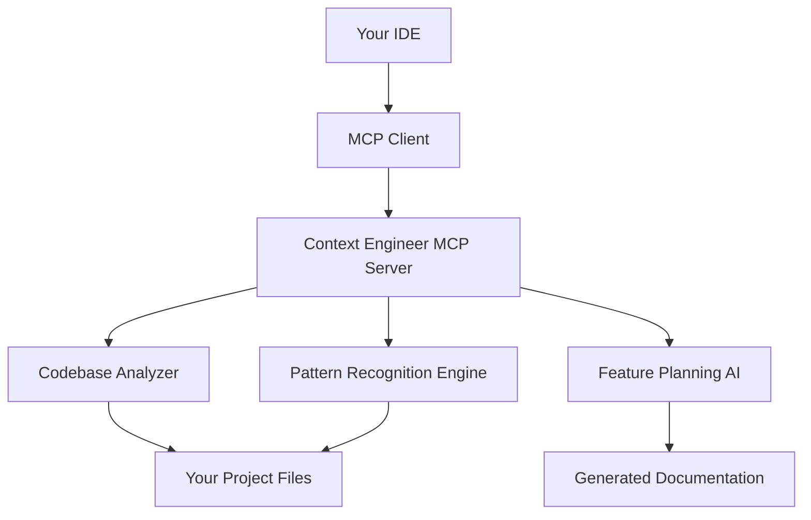

# 🚀 Context Engineering - MCP Server for Cursor, Claude Code & VS Code

<p align="center">
  
</p>

<p align="center">
  <strong>From Idea to Production without Context Loss</strong><br/>
  Give AI agents perfect understanding of your tech stack, architecture and established patterns.<br/>
  Build complex features <strong>10X more productive</strong>.
</p>

<p align="center">
  <a href="https://contextengineering.ai"></a>
  <a href="#installation"></a>
  <a href="#supported-platforms"></a>
</p>

---

## 🎯 What is Context Engineering?

**Context Engineering** is the practice of giving AI agents comprehensive understanding of your codebase, architecture, and development patterns. Our **MCP (Model Context Protocol) server** eliminates context loss that typically occurs when AI agents work on complex software projects.

### ⚡ The Problem We Solve

- **Context Loss**: AI agents lose track of your project's architecture across conversations
- **Inconsistent Patterns**: AI generates code that doesn't follow your established conventions  
- **Manual Explanations**: Repeatedly explaining your tech stack and project structure
- **Feature Complexity**: Building sophisticated features requires deep codebase understanding

### 🎉 The Context Engineering Solution

Our MCP server provides AI agents with:
- **Perfect Tech Stack Understanding** - Automatically analyzes your project dependencies and architecture
- **Codebase Pattern Recognition** - Learns your coding styles, naming conventions, and file structures  
- **Feature Planning Intelligence** - Generates comprehensive PRDs, technical blueprints, and implementation tasks
- **Cross-Platform Compatibility** - Works seamlessly with Cursor, Claude Code, VS Code, and any MCP-compatible IDE

## 🚀 Key Features

### 🧠 **Intelligent Feature Categorization**
- **8 Smart Categories**: Landing pages, UI components, APIs, performance, analytics, auth, data management, integrations
- **Automatic LLM Analysis**: Instantly categorizes your feature requests with confidence scoring
- **Tailored Planning Workflows**: Each category gets specialized questions and implementation guidance
- **Multi-Category Support**: Handles complex features spanning multiple domains

### 📋 **Automated Documentation Generation**
- **Comprehensive PRDs**: Product Requirements Documents with user stories and acceptance criteria
- **Technical Blueprints**: Architecture diagrams, API specs, and implementation phases  
- **Detailed Task Lists**: 40+ actionable development tasks with priority levels
- **Risk Assessment**: Identifies potential blockers and mitigation strategies

### 🏗️ **Advanced Codebase Analysis**
- **Tech Stack Detection**: Automatically identifies React, Vue, Express, Django, Rails, and more
- **Architecture Patterns**: Recognizes MVC, microservices, monoliths, and component structures
- **Database Integration**: Maps existing schemas, APIs, and authentication patterns
- **Legacy System Support**: Understands complex, multi-layer applications

---

## 🛠️ Supported Platforms

### ✅ Fully Compatible IDEs

| IDE | Status | Installation Guide |
|-----|--------|-------------------|
| **[Cursor](https://cursor.sh/)** | ✅ Full Support | [Cursor MCP Setup](#cursor-setup) |
| **[Claude Code](https://claude.ai/code)** | ✅ Full Support | [Claude Code MCP Setup](#claude-code-setup) |
| **[VS Code](https://code.visualstudio.com/)** | ✅ Full Support | [VS Code MCP Setup](#vs-code-setup) |
| **[Zed](https://zed.dev/)** | 🔄 Coming Soon | [Request Support](https://github.com/yourusername/context-engineer/issues) |
| **[JetBrains IDEs](https://www.jetbrains.com/)** | 🔄 Coming Soon | [Request Support](https://github.com/yourusername/context-engineer/issues) |

*Works with any IDE that supports the [Model Context Protocol (MCP)](https://modelcontextprotocol.io/)*

---

## 🎯 Use Cases

### 🏢 **Enterprise Development**
- **Large Codebases**: Maintain context across million-line projects
- **Team Consistency**: Ensure all developers follow established patterns
- **Legacy Migration**: Understand and modernize complex legacy systems
- **Microservices**: Coordinate development across multiple services

### 🚀 **Startup Velocity** 
- **Rapid Prototyping**: Build MVPs 10X faster with intelligent feature planning
- **Technical Debt Management**: Maintain code quality during rapid iteration
- **Full-Stack Development**: Single developer can handle complex, multi-layer features
- **Product Management**: Generate comprehensive technical specifications

### 🔧 **Open Source Projects**
- **Contributor Onboarding**: New contributors understand project structure instantly  
- **Documentation Generation**: Auto-generate technical documentation from codebase
- **Feature Roadmapping**: Plan complex features with detailed implementation guides
- **Code Review Assistance**: Ensure contributions follow project conventions

---

## 🏗️ Architecture

### Model Context Protocol (MCP) Integration
Context Engineer implements the **Model Context Protocol**, enabling seamless communication between AI agents and your development environment.



### Core Components
- **🔍 Codebase Analyzer**: Deep inspection of project structure and dependencies
- **🧩 Pattern Recognition Engine**: Learns coding styles and architectural decisions
- **📋 Feature Planning AI**: Generates comprehensive development documentation  
- **🔌 MCP Interface**: Standards-compliant protocol implementation

---

## 📊 Performance Benefits

| Metric | Before Context Engineering | After Context Engineering | Improvement |
|--------|---------------------------|---------------------------|-------------|
| **Feature Planning Time** | 4-8 hours | 15-30 minutes | **10-16X faster** |
| **Context Switching** | Every conversation | Never | **100% elimination** |
| **Code Consistency** | Manual reviews required | Automatic adherence | **Zero rework** |
| **Documentation Quality** | Inconsistent, outdated | Comprehensive, current | **Enterprise-grade** |

---

## 🚀 How to Use Context Engineering MCP

### Step 1: Generate Access Key
Visit [contextengineering.ai](https://contextengineering.ai) and sign up for a free account to generate your unique API key.

### Step 2: Add to Your IDE

#### For Cursor:
1. Open your Cursor configuration file: `~/.cursor/mcp.json`
2. Add the following configuration:
```json
{
  "mcpServers": {
    "context-engineer": {
      "url": "https://contextengineering.ai/mcp",
      "headers": {
        "Authorization": "Bearer your-access-key"
      }
    }
  }
}
```
3. Save the file
4. Go to Cursor Settings > Tools & Integrations > MCP Tools > Context Engineer and turn the toggle on
5. Restart Cursor IDE to apply the changes

#### For Windsurf:
1. Open your Windsurf configuration file:
   - Mac/Linux: `~/.windsurf/config.json`
   - Windows: `%APPDATA%\Windsurf\config.json`
2. Add the following configuration:
```json
{
  "mcpServers": {
    "context-engineer": {
      "serverUrl": "https://contextengineering.ai/mcp",
      "headers": {
        "Authorization": "Bearer your-access-key"
      }
    }
  }
}
```
3. Save and restart Windsurf

#### For Claude CLI:
Run this command in your terminal:
```bash
claude mcp add --transport http "Context-Engineer" https://contextengineering.ai/mcp --header "Authorization: Bearer your-access-key"
```

### Step 3: Test the Integration
In your IDE, type: "Help me plan a new feature" to verify the MCP server is connected.

### Step 4: Start Building
Create your first feature plan! Try prompts like:
- "I want to build an authentication system"
- "Help me create a landing page with analytics"
- "I need to develop an API for user management"

Your IDE is now ready to create context-rich feature plans that save you hours of development time! 🚀

---

## 💡 Real-World Use Cases & Examples

### 🎯 When to Use Context Engineering

**Perfect for:**
- **User Authentication Systems** - Simple idea with many edge cases (OAuth, JWT, session management)
- **Payment Integration** - Seems straightforward but involves complex security and error handling
- **File Upload Features** - Easy concept with security, validation, and performance concerns
- **API Development** - RESTful or GraphQL APIs with proper error handling and documentation
- **Dashboard & Analytics** - Complex data visualization with real-time updates
- **Multi-step Workflows** - Forms, wizards, or any feature touching multiple system parts
- **Third-party Integrations** - Connecting with external services and APIs

**Examples of Context Engineer in Action:**

1. **"I want to add Stripe payments to my SaaS"**
   - Analyzes your existing user model and database schema
   - Generates complete payment flow including subscriptions, webhooks, and error handling
   - Creates 40+ implementation tasks with proper security considerations

2. **"Help me build a real-time notification system"**
   - Maps your current authentication and user management
   - Plans WebSocket integration with your tech stack
   - Provides scalability considerations and fallback mechanisms

3. **"I need to add multi-tenant support to my app"**
   - Understands your current database structure
   - Creates migration strategy preserving existing data
   - Plans row-level security and tenant isolation

### 📊 Time Savings Analysis

Based on real usage data from building Context Engineer with itself:

| Feature Type | Manual Planning | With Context Engineer | Time Saved |
|--------------|----------------|----------------------|------------|
| Authentication System | 4-6 hours | 20 minutes | 93% |
| Payment Integration | 6-8 hours | 25 minutes | 92% |
| API Development | 3-4 hours | 15 minutes | 91% |
| Dashboard Features | 4-5 hours | 20 minutes | 90% |
| File Management | 2-3 hours | 10 minutes | 89% |

### 🚀 Token Usage Optimization

**Without Context Engineering:**
- Simple project: ~2,000 tokens (back-and-forth clarifications)
- Complex enterprise app: ~50,000+ tokens (extensive context sharing)
- Token usage grows exponentially with project complexity

**With Context Engineering:**
- Any project complexity: ~500 tokens (one-shot planning)
- Predictable token usage regardless of codebase size
- 10-50x reduction in token consumption for complex projects

### 🏗️ Works Especially Well With Complex Codebases

Context Engineering shines with:
- ✅ Large monorepos with multiple services
- ✅ Legacy codebases with technical debt
- ✅ Projects with custom frameworks
- ✅ Multi-language applications
- ✅ Microservices architectures
- ✅ Systems with complex business logic

The messier your codebase, the more value Context Engineering provides by automatically mapping complexity you'd struggle to explain manually.

### 🔄 Seamless Workflow Integration

**Your Current Flow:**
1. Idea → 2. Manual Planning → 3. Coding → 4. Debug/Refine

**With Context Engineering:**
1. Idea → 2. AI Planning (instant) → 3. Coding → 4. Ship faster

Zero disruption - Context Engineering enhances your existing workflow without changing how you code.

---

## ❓ Frequently Asked Questions

**Q: What counts as a "tool call"?**
A: Each action Context Engineer performs - analyzing code, generating PRD sections, or creating tasks. The free tier's 10 calls typically cover 1-2 complete feature planning sessions.

**Q: Will this work with my tech stack?**
A: Yes! Context Engineering is tech-stack agnostic. It works by understanding code patterns and structure, not specific technologies. Currently excels with JavaScript/TypeScript, Python, and most modern frameworks.

**Q: Is this overkill for simple features?**
A: Even "simple" features often have hidden complexity. A basic login page might need validation, error handling, security, and database integration. Context Engineering ensures nothing is missed.

**Q: How does this save me tokens?**
A: Instead of multiple back-and-forth conversations explaining your codebase, Context Engineering provides perfect context upfront. This reduces token usage by 10-50x for complex projects.

